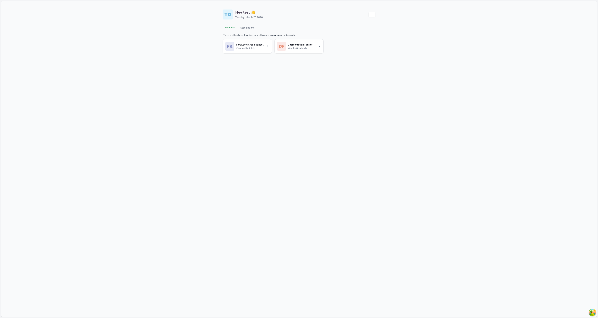
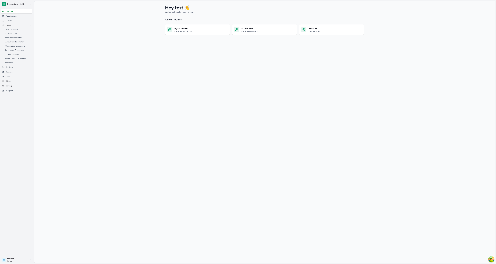
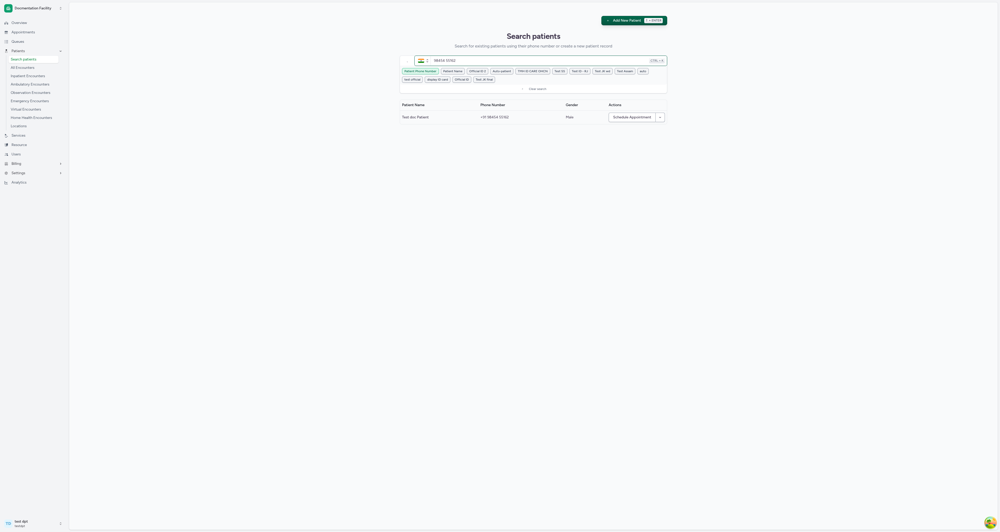
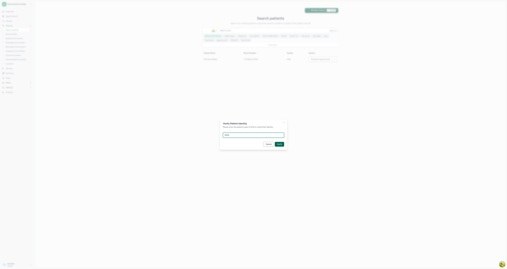
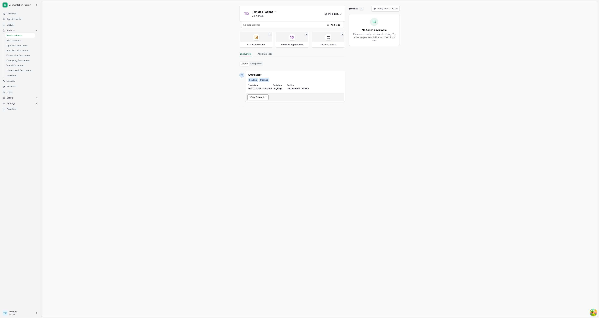
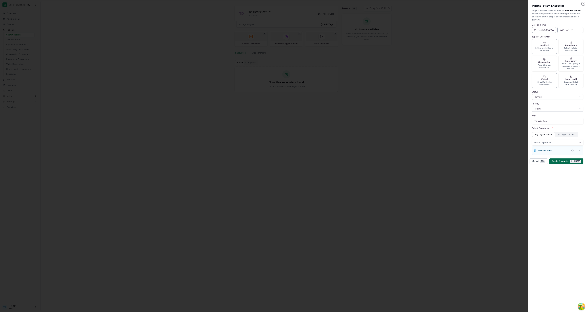
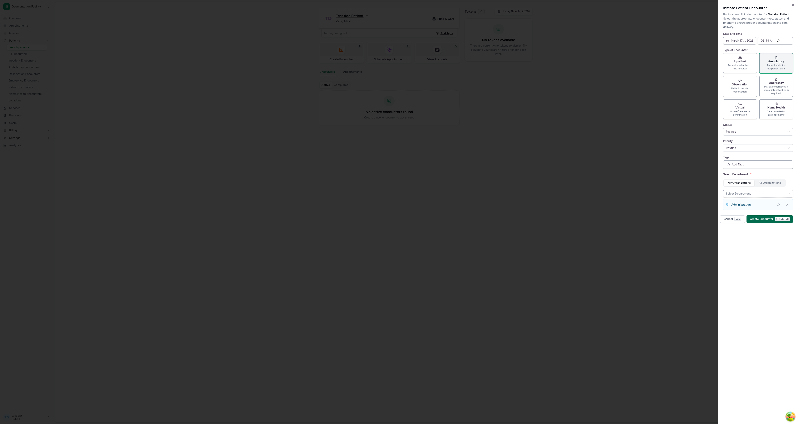
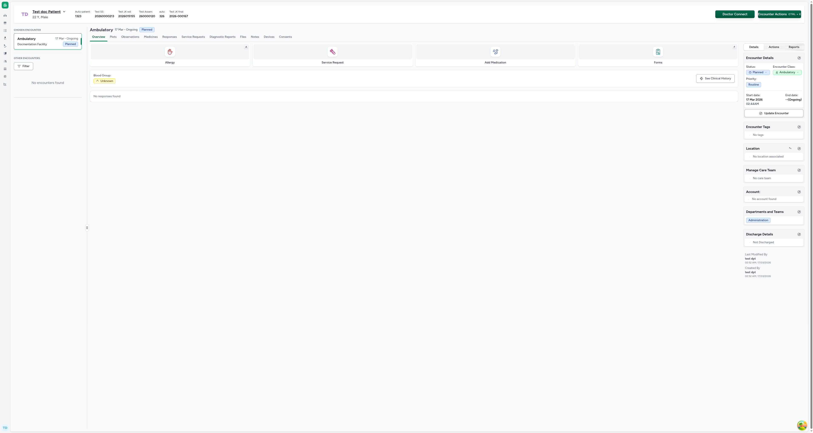

# Creating a Patient Encounter

## Purpose

This guide walks you through creating a new clinical encounter for an existing patient in the CARE application. An encounter represents a clinical interaction between a patient and healthcare provider — such as an outpatient visit, inpatient admission, emergency visit, or virtual consultation.

## Based On

- Routes: `src/Routers/routes/ConsultationRoutes.tsx`, `src/Routers/routes/PatientRoutes.tsx`
- Components: `src/components/Encounter/CreateEncounterForm.tsx`, `src/components/Patient/PatientIndex.tsx`, `src/pages/Patient/PatientHome.tsx`
- API: `src/types/emr/encounter/encounterApi.ts`
- Types: `src/types/emr/encounter/encounter.ts`
- Screenshot source: Live app at `http://localhost:4000`

## Prerequisites

- You must be logged in to CARE with valid credentials
- You must have access to a facility where the patient is registered
- You must know the patient's phone number and year of birth (for identity verification)
- You need appropriate permissions to create encounters

## Important Note

This is a **facility-scoped** workflow. You must first select and enter a facility before you can search for patients and create encounters.

---

## Step 1: Select Your Facility

**Action:**
From the dashboard, click on the facility card where you want to create the encounter (e.g., "Docmentation Facility").

**What you should see:**
The dashboard displays all facilities you have access to under the "Facilities" tab. Each facility shows its name and a "View facility details" link.

**Screenshot:**

**Evidence from code:**

- Route: `/` (dashboard)
- Component: `src/pages/FacilityDashboard.tsx`

---

## Step 2: Navigate to Patient Search

**Action:**
Once inside the facility, expand the **Patients** menu in the left sidebar and click **"Search patients"**.

**What you should see:**
The facility overview page shows a welcome message, quick action cards (My Schedules, Encounters, Services), and a left sidebar with navigation items including Patients (with sub-items like Search patients, All Encounters, Inpatient Encounters, etc.).

**Screenshot:**

**Evidence from code:**

- Route: `/facility/:facilityId/overview`
- Sidebar: `src/components/ui/sidebar/`

**Notes:**
If the sidebar is collapsed (showing only icons), click the toggle button at the bottom of the sidebar to expand it and see menu labels.

---

## Step 3: Search for the Patient

**Action:**
On the "Search patients" page, type the patient's phone number in the search box (e.g., `9845455162`) and wait for results to appear.

**What you should see:**
A search page with a phone number input field (defaulting to "Search by Patient Phone Number" mode), filter buttons for different search modes (Patient Phone Number, Patient Name, Official ID, etc.), and a results table showing matching patients with columns: Patient Name, Phone Number, Gender, and Actions.

**Screenshot:**

**Evidence from code:**

- Route: `/facility/:facilityId/patients`
- Component: `src/components/Patient/PatientIndex.tsx`

**Notes:**

- The phone number field accepts up to 10 digits
- You can also search by patient name, official ID, or other identifiers using the filter buttons
- The keyboard shortcut `Ctrl + K` focuses the search box

---

## Step 4: Verify Patient Identity

**Action:**
Click on the patient row in the search results. A **"Verify Patient Identity"** dialog will appear. Enter the patient's year of birth (e.g., `2004`) and click **"Verify"**.

**What you should see:**
A modal dialog titled "Verify Patient Identity" with the message "Please enter the patient's year of birth to verify their identity", a text input for "Year of Birth (YYYY)", and Cancel / Verify buttons.

**Screenshot:**

**Evidence from code:**

- Component: `src/components/Patient/PatientIndex.tsx`

**Notes:**

- This verification step is a privacy measure to prevent unauthorized access to patient records
- The year must be in YYYY format (e.g., 2004)
- If the year of birth doesn't match, verification will fail

---

## Step 5: View Patient Home and Initiate Encounter

**Action:**
After successful verification, you will land on the patient home page. Click the **"Create Encounter"** button in the quick actions section.

**What you should see:**
The patient home page shows:

- Patient information card (name, age, gender)
- Quick action buttons: **Create Encounter**, **Schedule Appointment**, **View Accounts**
- Encounters tab with Active/Completed sub-tabs
- Tokens panel on the right

**Screenshot:**

**Evidence from code:**

- Route: `/facility/:facilityId/patients/home?...`
- Component: `src/pages/Patient/PatientHome.tsx`

**Notes:**

- The keyboard shortcut `E` can also open the Create Encounter form
- If the patient already has active encounters, they will be listed under the "Active" tab

---

## Step 6: Fill the Encounter Form

**Action:**
The **"Initiate Patient Encounter"** panel slides in from the right. Fill in the form:

1. **Date and Time** — Defaults to the current date and time. Adjust if needed.
2. **Type of Encounter** — Select one of the six types:
   - **Inpatient** — Patient is admitted to the hospital
   - **Ambulatory** — Patient visits for outpatient care
   - **Observation** — Patient is under observation
   - **Emergency** — Immediate attention required
   - **Virtual** — Virtual/telehealth consultation
   - **Home Health** — Care provided at patient's home
3. **Status** — Select from: Planned, In Progress, or On Hold (defaults to "Planned")
4. **Priority** — Select from: Routine, Urgent, ASAP, STAT, Callback (defaults to "Routine")
5. **Tags** — Optionally add tags to categorize the encounter
6. **Select Department** — Choose at least one department (required). Departments from "My Organizations" tab are shown by default.

**What you should see:**
A slide-out panel with all the fields described above. The encounter type selector shows six card-style options with icons and descriptions. Status and Priority are dropdown selects. The department selector shows available departments with options to mark as preferred or remove.

**Screenshot:**

**Evidence from code:**

- Component: `src/components/Encounter/CreateEncounterForm.tsx`
- Validation: Uses `zod` schema requiring at least one department

**Notes:**

- At least one department must be selected — the form will not submit without it
- The "All Organizations" tab shows all facility departments if you need one outside your assigned organizations
- The available encounter types depend on facility configuration (`care.config.ts` → `encounterClasses`)

---

## Step 7: Create the Encounter

**Action:**
Click the **"Create Encounter"** button at the bottom of the form (or use the keyboard shortcut `Shift + Enter`).

**What you should see:**
After successful creation:

- A success toast notification "Encounter created" appears
- You are redirected to the encounter detail page
- The encounter overview shows tabs: Overview, Plots, Observations, Medicines, Responses, Service Requests, Diagnostic Reports, Files, Notes, Devices, Consents
- Quick action cards for: Allergy, Service Request, Add Medication, Fever
- Right sidebar shows Encounter Details with Status, Encounter Class, Priority, Start Date, End Date, and sections for Encounter Tags, Location, Manage Care Team, Accounts, Departments and Teams, and Discharge Details

**Screenshot:**

**Evidence from code:**

- Route: `/facility/:facilityId/patient/:patientId/encounter/:encounterId/updates`
- API: `POST /api/v1/encounter/` via `encounterApi.create`
- Component: `src/components/Encounter/CreateEncounterForm.tsx` → `onSuccess` handler

---

## Expected Result

A new encounter is created and you are redirected to the encounter detail page where you can:

- Record observations and vitals
- Add medications and allergies
- Create service requests and diagnostic reports
- Upload files and add notes
- Manage the care team and location assignments
- Update encounter status and discharge details

The encounter also appears in the patient's home page under the "Active" encounters tab.

---

## Troubleshooting

| Problem                               | Likely Cause                          | Solution                                                                   |
| ------------------------------------- | ------------------------------------- | -------------------------------------------------------------------------- |
| "Create Encounter" button not visible | Insufficient permissions              | Ensure your user role has encounter creation permissions for this facility |
| Verify Patient Identity fails         | Incorrect year of birth               | Confirm the correct year of birth with the patient or from records         |
| Form won't submit                     | Missing required department           | Select at least one department from the department selector                |
| No departments available              | User not assigned to any organization | Ask a facility admin to assign you to an organization/department           |
| Encounter type options missing        | Facility configuration                | Check `care.config.ts` → `encounterClasses` for enabled types              |
| Page not loading after facility click | Network/API issue                     | Check browser console for errors; verify backend connectivity              |

---

## Implementation Notes

- **UI Labels Observed:** "Initiate Patient Encounter", "Create Encounter", "Verify Patient Identity", "Search patients"
- **Routes:**
  - Dashboard: `/`
  - Facility Overview: `/facility/:facilityId/overview`
  - Patient Search: `/facility/:facilityId/patients`
  - Patient Home: `/facility/:facilityId/patients/home?...`
  - Encounter Detail: `/facility/:facilityId/patient/:patientId/encounter/:encounterId/updates`
- **API Mutations:** `POST /api/v1/encounter/` (via `encounterApi.create`)
- **Key Components:**
  - `CreateEncounterForm.tsx` — Form with zod validation, uses `react-hook-form`
  - `PatientIndex.tsx` — Patient search with phone/name/ID, includes identity verification dialog
  - `PatientHome.tsx` — Patient overview page with quick actions
- **Form Validation:** zod schema requires `status`, `encounter_class`, `priority`, `organizations` (min 1), `start_date`, and `tags`
- **Keyboard Shortcuts:**
  - `E` — Open Create Encounter form from patient home
  - `Shift + Enter` — Submit the encounter form
  - `ESC` — Cancel/close the form
  - `Ctrl + K` — Focus patient search box
- **Default Values:** Status = "Planned", Priority = "Routine", Date = current date/time
