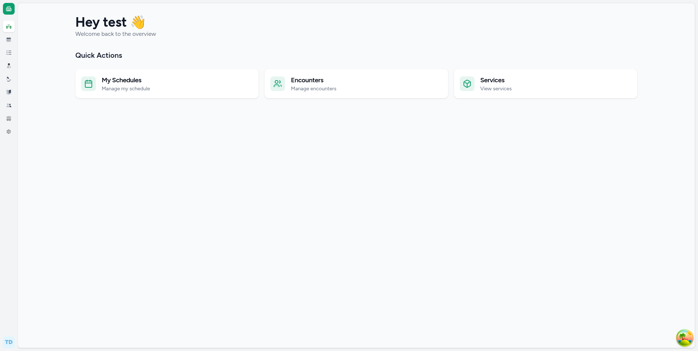
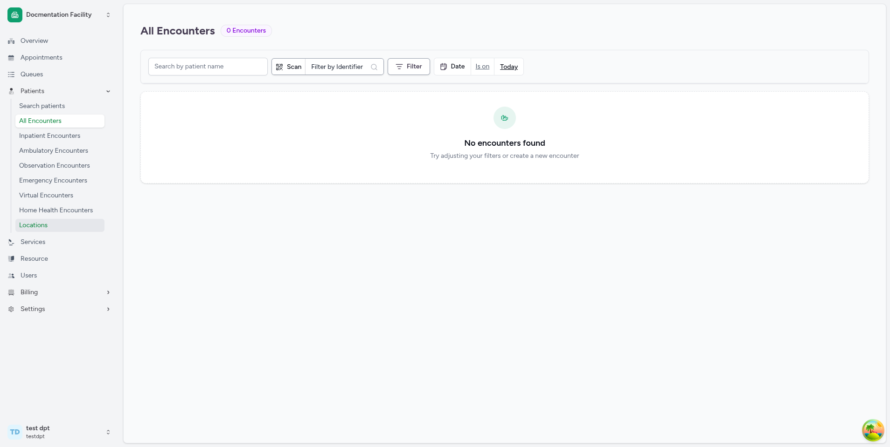
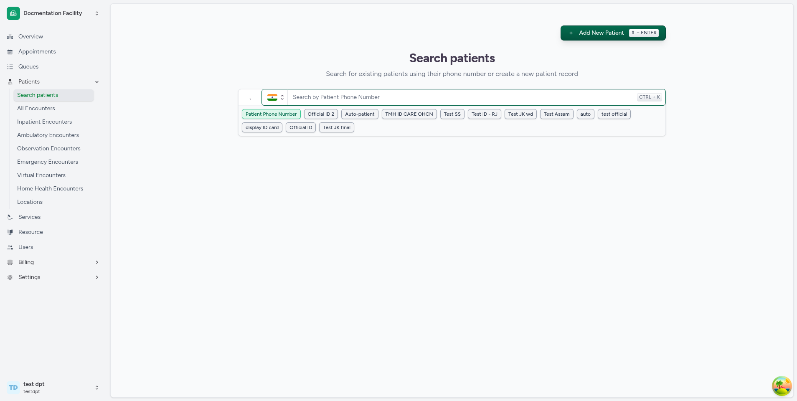
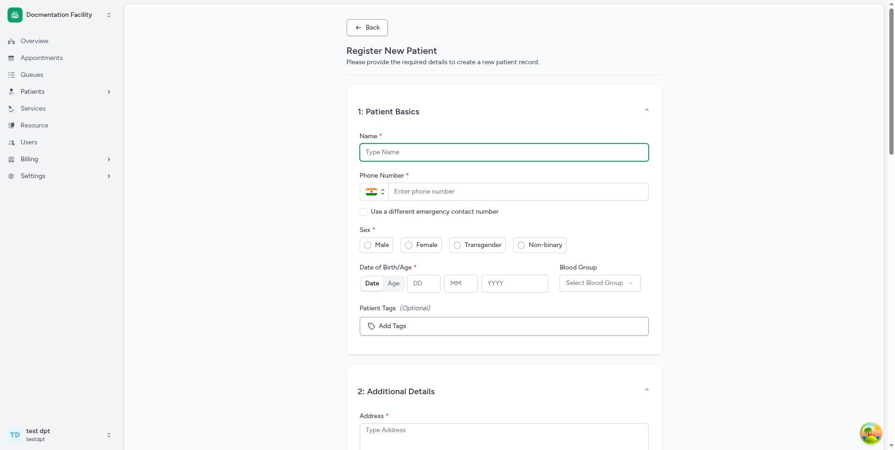
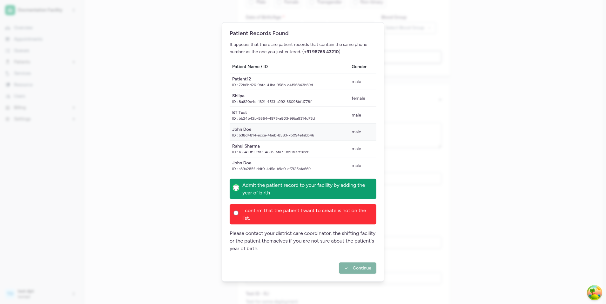
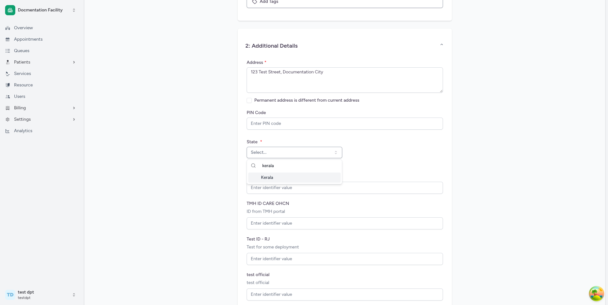
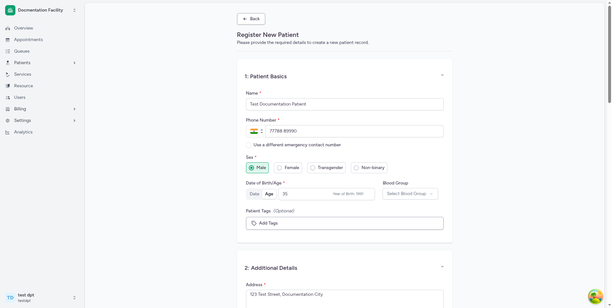
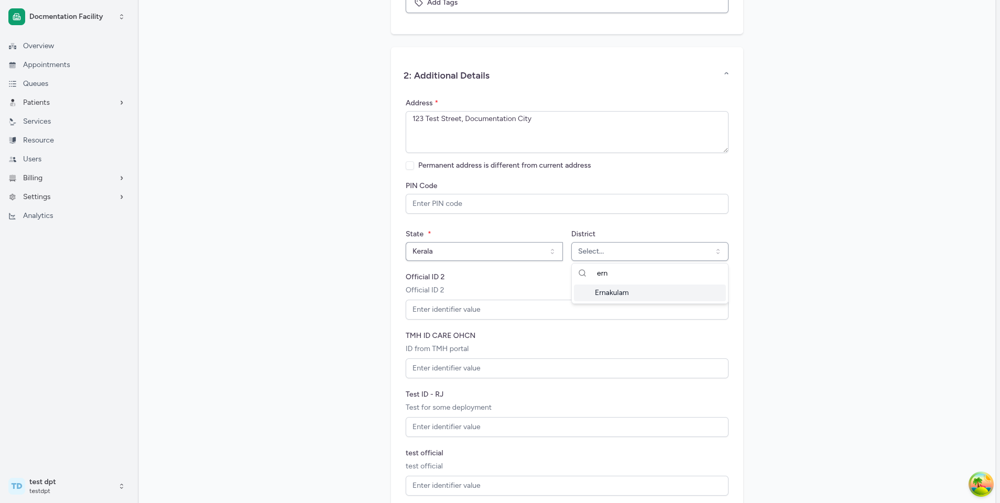
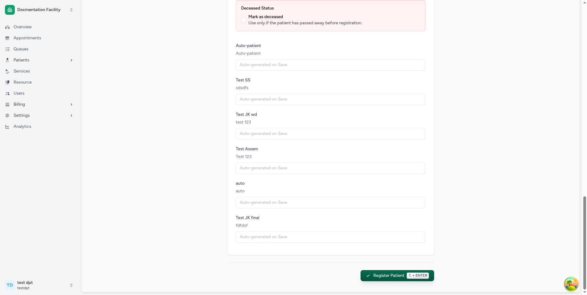

# Patient Creation Flow

## Purpose

This flow allows a healthcare worker to register a new patient within a facility in the CARE system. The result is a patient record linked to the facility, ready for scheduling appointments, creating encounters, or other clinical workflows.

## Quick Start — Using the Documentation Facility

To follow along with this guide, use the **Documentation Facility** test account:

| Field        | Value                   |
| ------------ | ----------------------- |
| **App URL**  | `http://localhost:4000` |
| **Login as** | Staff                   |
| **Username** | `testdpt`               |
| **Password** | `Ohcndoc@123`           |
| **Facility** | Documentation Facility  |

After logging in, select the **Documentation Facility** from the facility list on the home page. Then follow the steps below.

## Based On

- **Routes:**
  - `/facility/:facilityId/patients` — Patient search page ([PatientRoutes.tsx](../../src/Routers/routes/PatientRoutes.tsx))
  - `/facility/:facilityId/patient/create` — Patient registration form ([PatientRoutes.tsx](../../src/Routers/routes/PatientRoutes.tsx))
  - `/facility/:facilityId/patients/home` — Patient home page after creation ([PatientRoutes.tsx](../../src/Routers/routes/PatientRoutes.tsx))
- **Components:**
  - [PatientIndex.tsx](../../src/components/Patient/PatientIndex.tsx) — Search patients page
  - [PatientRegistration.tsx](../../src/components/Patient/PatientRegistration.tsx) — Patient registration form
  - [facility-nav.tsx](../../src/components/ui/sidebar/facility/facility-nav.tsx) — Sidebar navigation
  - [PatientHome.tsx](../../src/pages/Patient/PatientHome.tsx) — Patient home page (post-creation landing)
- **Tests:**
  - [patientRegistration.spec.ts](../../tests/facility/patient/patientRegistration.spec.ts)
- **i18n source:** [en.json](../../public/locale/en.json)
- **Confidence:**
  - **Confirmed:** Route paths, form fields, field labels (from i18n), validation schema, submit button text, API endpoint, success toast message, redirect target, sidebar menu structure, test steps
  - **Inferred:** Exact visual layout order (from component render order); facility identifier fields depend on facility configuration
  - **Unclear:** Exact appearance of facility-specific patient identifiers (dynamically loaded from facility config); extension fields (plugin-dependent)

## Prerequisites

- You must be **logged in** to CARE with a user account that has patient-related permissions
- You must have selected and entered a **Facility** (the entire patient flow is scoped to a facility)
- Your user role must have permission to create patients (the "Add New Patient" button only appears if `canCreatePatient` is true)

## Important Note

> **Make sure you are inside the correct Facility before starting.**
>
> The patient registration flow is entirely facility-scoped. All routes begin with `/facility/:facilityId/...`. If you are not inside a facility, you will not see the **Patients** menu in the sidebar.

---

## Step 1: Log In and Open the Facility

**Action:**

1. Open the CARE application at `http://localhost:4000`
2. Click **Log in as Staff**
3. Enter your username and password (for testing: `testdpt` / `Ohcndoc@123`)
4. After login, you will see the home page with a list of facilities
5. Click on **Documentation Facility** (or your target facility)

**What you should see:**
The facility overview page loads. The left sidebar shows facility-specific navigation items including **Overview**, **Appointments**, **Queues**, **Patients**, **Services**, **Resource**, **Users**, and **Billing**.

**Evidence from code:**

- Route: `/facility/:facilityId/overview`
- Component: Sidebar defined in [facility-nav.tsx](../../src/components/ui/sidebar/facility/facility-nav.tsx)
- The "Patients" menu item uses the label `t("patients")` → **"Patients"**
- Visibility depends on permissions: `canWriteAppointment || canListEncounters || canCreateEncounter`

**Screenshot:**

**Notes:**

- The sidebar is collapsible. If you don't see the full navigation, click the **Toggle Sidebar** button (hamburger icon at the top of the sidebar).
- The "Patients" section is only visible if your role has the required permissions.

---

## Step 2: Navigate to Search Patients

**Action:**
In the left sidebar, click **Patients** to expand the submenu. Then click **Search patients**.

**What you should see:**
The "Patients" menu expands to show child links:

- **Search patients** — main patient search page
- **All Encounters** (shown if more than one encounter class is configured)
- Encounter-class-specific links (e.g., "Ambulatory Encounters", "Inpatient Encounters")
- **Locations**

Clicking **Search patients** navigates to the patient search page.

**Evidence from code:**

- Route: `/facility/:facilityId/patients`
- Sidebar child link: `{ name: t("search_patients"), url: \`${baseUrl}/patients\` }` in [facility-nav.tsx](../../src/components/ui/sidebar/facility/facility-nav.tsx)
- Page component: `PatientIndex` in [PatientIndex.tsx](../../src/components/Patient/PatientIndex.tsx)
- Page heading: `t("search_patients")` → **"Search patients"**
- Page description (for users with create permission): `t("search_patient_page_text")` → **"Search for existing patients using their phone number or create a new patient record"**

**Screenshot:**

**Notes:**

- If you do not have patient create permission, the description instead shows: **"Search for existing patients using their phone number"** and the "Add New Patient" button will not appear.

---

## Step 3: Search for Existing Patients (Recommended)

**Action:**
On the Search Patients page, use the search box to look up the patient by **phone number** or another configured identifier. This step helps avoid creating duplicate records.

**What you should see:**

- A search input field at the top of the page
- If a matching patient is found, a table appears with columns: **Patient Name**, **Phone Number**, **Gender**, and **Actions**
- Each result row has actions: **Schedule Appointment**, **Create Encounter**, and **Patient Home** (in a dropdown)
- If no match is found, a message appears: **"No Patient Records Found"** with the text: **"No existing records found with this [identifier]. Would you like to register a new patient?"** and an **Add New Patient** button

**Evidence from code:**

- Search component: `SearchInput` in [PatientIndex.tsx](../../src/components/Patient/PatientIndex.tsx)
- API: `POST /api/v1/patient/search/` in [patientApi.ts](../../src/types/emr/patient/patientApi.ts)
- No results label: `t("no_patient_record_found")` → **"No Patient Records Found"**
- No results text: `t("no_patient_record_text")` → **"No existing records found with this {{text}}. Would you like to register a new patient?"**

**Screenshot:**

**Notes:**

- Searching first is a best practice to prevent duplicate patient records.
- If you skip the search, you can use the **Add New Patient** button at the top right (visible when you have create permission).

---

## Step 4: Click "Add New Patient"

**Action:**
Click the **Add New Patient** button. This button appears in two places:

1. At the top-right of the Search Patients page (always visible if you have permission)
2. In the "no results" area after a search returns zero matches

**What you should see:**
You are navigated to the patient registration form page. The page title shows **"Register New Patient"** with the description **"Please provide the required details to create a new patient record."**

**Evidence from code:**

- Button component: `AddPatientButton` in [PatientIndex.tsx](../../src/components/Patient/PatientIndex.tsx)
- Button label: `t("add_new_patient")` → **"Add New Patient"**
- Navigation target: `/facility/:facilityId/patient/create`
- If a phone number was entered in the search, it is passed as a query parameter and pre-filled in the form
- Page title: `t("register_new_patient")` → **"Register New Patient"**
- Page description: `t("patient_create_description")` → **"Please provide the required details to create a new patient record."**

**Screenshot:**

**Notes:**

- Keyboard shortcut: You can press the shortcut associated with `submit-action` (displayed as a badge on the button) to trigger this action.
- If your search included a phone number, the phone number field will be pre-populated on the registration form.

---

## Step 5: Fill in Section 1 — Patient Basics

The form is divided into two accordion sections. **Section 1: Patient Basics** is expanded by default.

### 5a. Name (Required)

**Action:** Enter the patient's full name in the **Name** field.

**What you should see:** A text input with placeholder **"Type name"**.

**Evidence from code:**

- Field: `name` — `z.string().trim().nonempty(t("field_required"))`
- Label: `t("name")` → **"Name"**
- Validation: Cannot be empty. Error message: **"This field is required"**

---

### 5b. Phone Number (Required)

**Action:** Enter the patient's phone number in the **Phone Number** field.

**What you should see:** A phone input field with country code selector and placeholder **"Enter phone number"**.

**Evidence from code:**

- Field: `phone_number` — `validators().phoneNumber.required`
- Label: `t("phone_number")` → **"Phone Number"**
- Validation: Must be a valid international phone number. Error message if invalid: **"entered phone number is not valid"** (confirmed by test)

**Notes:**

- The system will automatically search for patients with the same phone number. If duplicates are found, a **Duplicate Patient Dialog** appears warning you that a patient with this phone number already exists. You can choose to:
  - View the existing patient
  - Dismiss the warning and continue creating a new record

---

### 5c. Emergency Contact Number (Conditional)

**Action:** By default, the emergency contact number is the same as the primary phone number. To use a different number, check the checkbox labeled **"Use a different emergency contact number"**, then enter the emergency phone number.

**What you should see:** A checkbox appears below the phone number field. When checked, a new phone input field labeled **"Emergency Phone Number"** appears.

**Evidence from code:**

- Checkbox label: `t("use_different_emergency_contact_number")` → **"Use a different emergency contact number"**
- Field: `emergency_phone_number`
- Default: `emergency_phone_number_same_as_phone_number = true`

---

### 5d. Sex (Required)

**Action:** Select the patient's sex from the radio button options.

**What you should see:** Radio buttons with the options:

- **Male**
- **Female**
- **Transgender**
- **Non-binary**

**Evidence from code:**

- Field: `gender` — `z.enum(GENDERS)`
- Label: `t("sex")` → **"Sex"**
- Options from `GENDER_TYPES` in [constants.tsx](../../src/common/constants.tsx): `male`, `female`, `transgender`, `non_binary`
- Display labels via i18n: `t("GENDER__male")` → **"Male"**, `t("GENDER__female")` → **"Female"**, `t("GENDER__transgender")` → **"Transgender"**, `t("GENDER__non_binary")` → **"Non-binary"**

---

### 5e. Date of Birth or Age (Required)

**Action:** Choose between entering a **Date of Birth** or an **Age** using the tab selector, then fill in the value.

**What you should see:**

- A tabbed control with two tabs: **Date** and **Age**
- If **Date** is selected: three input fields for DD, MM, YYYY
- If **Age** is selected: a numeric input (0–120) with a calculated "Year of Birth" displayed next to it

**Evidence from code:**

- Field: `age_or_dob` (tab selector), `date_of_birth`, `age`
- Label: `t("date_of_birth_or_age")` → **"Date of Birth/Age"**
- DOB validation: Must not be a future date
- Age validation: `validators().age` — must be between 0 and 120
- Year of Birth display: calculated as `current year - entered age`

**Notes:**

- If you select **Date**, the **Age** tab input is ignored, and vice versa.
- Both tabs require a value — you cannot leave this field blank.

---

### 5f. Blood Group (Optional)

**Action:** Select a blood group from the dropdown.

**What you should see:** A dropdown (select) with placeholder **"Select Blood Group"** and the following options:

- Unknown, A+, A-, B+, B-, AB+, AB-, O+, O-

**Evidence from code:**

- Field: `blood_group` — `z.nativeEnum(BloodGroupChoices).optional()`
- Label: `t("blood_group")` → **"Blood Group"**
- Options from `BLOOD_GROUP_CHOICES` in [constants.tsx](../../src/common/constants.tsx)

---

### 5g. Required Identifiers (Facility-Dependent)

**Action:** If the facility has configured required patient identifiers (e.g., Aadhaar Number, MRN), fill in the required identifier fields.

**What you should see:** One or more text input fields, each labeled with the identifier's display name as configured by the facility. These fields are marked as required.

**Evidence from code:**

- Fields: `required_identifiers` array — each entry validated with `z.string().nonempty(t("field_required"))`
- Identifiers loaded from `facility.patient_instance_identifier_configs` filtered by `getRequiredIdentifierConfigs()`
- Labels come from `config.display` (facility-specific)

**Notes:**

- These fields are dynamically determined by the facility's configuration. Different facilities may have different required identifiers.
- If the facility has no required identifier configs, this section will not appear.

---

### 5h. Patient Tags (Optional, Create Only)

**Action:** Click the **Patient Tags** selector to assign tags to the patient.

**What you should see:** A popover selector where you can search and select from available patient tags configured for the facility.

**Evidence from code:**

- Field: `tags` — `z.array(z.string())`
- Label: `t("patient_tags")` → **"Patient Tags"** with "(Optional)" suffix
- Component: `TagSelectorPopover` with `resource={TagResource.PATIENT}`
- Only shown when creating a new patient (not during update)

---

When you enter a phone number that matches an existing patient, CARE will show a duplicate patient warning dialog:

You can dismiss this and continue, or navigate to the existing patient.

Here is the Patient Basics section partially filled in:

And the completed Patient Basics section:

---

## Step 6: Fill in Section 2 — Additional Details

The second accordion section is labeled **"2: Additional Details"**. In standard registration mode, it is expanded by default. In quick registration mode (if configured), it is collapsed and marked as **(Optional)**.

### 6a. Address (Required in standard mode)

**Action:** Enter the patient's current address in the **Address** text area.

**What you should see:** A text area with placeholder **"Type address"**.

**Evidence from code:**

- Field: `address` — required unless quick registration is enabled
- Label: `t("address")` → **"Address"**

---

### 6b. Permanent Address (Required in standard mode)

**Action:** By default, the permanent address is the same as the current address. If different, check the checkbox labeled **"Permanent address is different from current address"**, then enter the permanent address.

**What you should see:** A checkbox below the address field. When checked, a second text area labeled **"Permanent Address"** appears.

**Evidence from code:**

- Checkbox label: `t("permanent_address_is_different_from_current_address")` → **"Permanent address is different from current address"**
- Field: `permanent_address`

---

### 6c. PIN Code (Optional)

**Action:** Enter the patient's PIN code / postal code.

**What you should see:** A numeric input field labeled **"PIN Code"**.

**Evidence from code:**

- Field: `pincode` — `validators().pincode.optional()`
- Label: `t("pincode")` → **"PIN Code"**

---

### 6d. Geo Organization (Required)

**Action:** Select the government organization hierarchy (e.g., State, District, Local Body, Ward) from cascading dropdown selectors.

**What you should see:** One or more cascading dropdown/combobox selectors, each representing a level in the government organization hierarchy.

**Evidence from code:**

- Field: `geo_organization` — validated by `geoOrgValidator(t)` (UUID required)
- Component: `GovtOrganizationSelector` in [GovtOrganizationSelector](../../src/pages/Organization/components/GovtOrganizationSelector.tsx)
- Required depth configured by `careConfig.patientRegistration.minGeoOrganizationLevelsRequired`

**Notes:**

- The number and labels of levels depend on the system's geographic organization configuration.
- A default geo organization may be pre-selected if configured in `careConfig.patientRegistration.defaultGeoOrganization`.

---

### 6e. Optional Identifiers (Facility-Dependent)

**Action:** If the facility has configured optional patient identifiers, fill them in as needed.

**What you should see:** Text input fields for each optional identifier, labeled with the identifier's display name.

**Evidence from code:**

- Fields: `optional_identifiers` array — values are optional strings
- Loaded from `facility.patient_instance_identifier_configs` filtered by `getOptionalIdentifierConfigs()`

---

### 6f. Deceased Status (Optional)

**Action:** If the patient is deceased, check the checkbox labeled **"Mark as deceased"**.

**What you should see:** A section with a red/warning background containing:

- Label: **"Deceased Status"**
- Checkbox: **"Mark as deceased"**
- Description: **"Use only if patient has passed away before registration"**
- If checked: A date-time input labeled **"Date and Time of Death"** appears

**Evidence from code:**

- Field: `is_deceased` (boolean), `deceased_datetime` (datetime, optional)
- Labels: `t("deceased_status")` → **"Deceased Status"**, `t("mark_as_deceased")` → **"Mark as deceased"**
- Validation: Death date must be after date of birth

---

### 6g. Auto-generated Identifiers (Facility-Dependent, Read-Only)

**What you should see:** If the facility has auto-generated identifier configs, disabled text fields appear with placeholder **"Identifier value will be auto-generated"**. These cannot be edited.

**Evidence from code:**

- Fields: `autogenerated_identifiers` array
- Input is disabled (`disabled` prop)

---

The Geo Organization selector uses cascading dropdowns. Here is the state/district selection:

Searching for a district within the selector:

---

**Screenshot:**

---

## Step 7: Submit the Registration

**Action:**
Click the **Register Patient** button at the bottom of the form.

**What you should see:**

- The button is labeled **"Register Patient"** with a checkmark icon
- The button is disabled if:
  - The form has not been modified (no fields changed)
  - A submission is in progress
  - Extension schemas are still loading
- After clicking, the form submits and (if successful) you see a success toast

**Evidence from code:**

- Button label: `t("register_patient")` → **"Register Patient"**
- Button variant: `primary_gradient`
- Disabled condition: `!form.formState.isDirty || isPending || isExtensionsLoading`
- Mutation: `useMutation` with `mutate(patientApi.create)` — `POST /api/v1/patient/`
- Keyboard shortcut: `submit-action` (badge displayed on button)

**Screenshot:**
See the bottom of the form in the screenshot above ([step-09-form-section2-register.png](../../step-09-form-section2-register.png)).

**Notes:**

- If the form has validation errors, error messages appear next to the relevant fields and the form is not submitted.
- A navigation prompt (**"Unsaved changes"**) appears if you try to leave the page while the form has been modified but not submitted.

---

## Expected Result

After successful submission:

1. **Toast notification:** A green success toast appears with the message **"Patient Registered Successfully"**
2. **Redirect:** You are navigated to the **Patient Home** page at `/facility/:facilityId/patients/home` with query parameters for patient verification
3. **Patient Home page:** Shows:
   - Patient information card with name, age, gender, phone number, and tags
   - Quick action buttons:
     - **Create Encounter** (if you have encounter creation permission)
     - **Schedule Appointment** (if you have appointment permission)
     - **Create Token** (if you have token permission)
   - Tabs for Encounters, Appointments, Medical Records, etc.

**Evidence from code:**

- Success toast: `toast.success(t("patient_registration_success"))` → **"Patient Registered Successfully"**
- Redirect: `navigate(\`/facility/${facilityId}/patients/home\`, { query: { phone_number, year_of_birth, partial_id, ... } })`
- Patient Home: [PatientHome.tsx](../../src/pages/Patient/PatientHome.tsx) — verifies patient via `POST /api/v1/patient/search_retrieve/`

**Screenshot:**
[No screenshot captured for this step — the success toast and Patient Home page appear after form submission.]

---

## Troubleshooting

| Problem                                       | Likely Cause                                                        | Solution                                                                             |
| --------------------------------------------- | ------------------------------------------------------------------- | ------------------------------------------------------------------------------------ |
| **"Add New Patient" button not visible**      | Your user role lacks patient creation permission                    | Contact an administrator to update your role/permissions                             |
| **"Patients" menu not visible in sidebar**    | Missing appointment/encounter permissions, or not inside a facility | Ensure you have entered a facility and have the required permissions                 |
| **"This field is required" error**            | A required field was left empty                                     | Fill in all fields marked with an asterisk (\*)                                      |
| **"entered phone number is not valid"**       | Phone number format is incorrect                                    | Enter a valid phone number with country code (e.g., +91 9876543210)                  |
| **Duplicate Patient Dialog appears**          | A patient with the same phone number already exists                 | Review the existing patient record; dismiss if you want to proceed with a new record |
| **"Register Patient" button is disabled**     | No fields have been changed, or submission is in progress           | Ensure you have filled in at least one field; wait for any pending submission        |
| **Date validation error**                     | Date of birth is in the future, or death date is before birth date  | Correct the date values                                                              |
| **Geo organization error**                    | Government organization hierarchy not selected to required depth    | Select values at each required level of the hierarchy                                |
| **Form shows "Unsaved changes" when leaving** | You modified the form but didn't submit                             | Submit the form first, or confirm you want to leave                                  |

---

## Implementation Notes

- **Route labels:**
  - Sidebar: "Patients" → "Search patients"
  - Search page: heading "Search patients"
  - Registration page: heading "Register New Patient"
  - Submit button: "Register Patient"
  - Success toast: "Patient Registered Successfully"

- **Key components:**
  - `PatientIndex` — search page with `AddPatientButton`
  - `PatientRegistration` — form page (shared for create and update)
  - `PatientBasicsContent` — Section 1 fields
  - `AdditionalDetailsContent` — Section 2 fields
  - `DuplicatePatientDialog` — duplicate warning modal
  - `GovtOrganizationSelector` — geo org hierarchy selector

- **Mutation / API:**
  - Create: `POST /api/v1/patient/` via `patientApi.create`
  - Duplicate check: `POST /api/v1/patient/search/` via `patientApi.search`
  - Post-creation verify: `POST /api/v1/patient/search_retrieve/` via `patientApi.searchRetrieve`

- **Conditions / Feature flags:**
  - `careConfig.patientRegistration.minimalPatientRegistration` — if `true`, address/permanent address become optional ("Quick Registration" mode) and the Additional Details section is collapsed by default with "(Optional)" label
  - `careConfig.patientRegistration.defaultGeoOrganization` — auto-selects a default geo org
  - `careConfig.patientRegistration.minGeoOrganizationLevelsRequired` — controls required depth for geo org selection
  - `careConfig.openScheduleAfterPatientRegistration` — if `true`, passes `open_schedule=true` to patient home page
  - Facility-specific identifier configs control which identifier fields appear
  - Extension fields (via plugin system) may add additional form fields

- **Permissions:**
  - `canCreatePatient` — controls visibility of "Add New Patient" button
  - `canWriteAppointment`, `canListEncounters`, `canCreateEncounter` — control "Patients" sidebar visibility
  - `canViewAppointments`, `canWriteAppointment`, `canCreateEncounter`, `canWriteToken` — control quick actions on Patient Home page

- **Gaps / Uncertainties:**
  - Exact appearance and number of facility identifier fields depend on facility runtime configuration
  - Extension fields added by plugins cannot be fully documented from code alone
  - The exact geo organization hierarchy labels depend on system configuration

- **Suggested places to update docs if code changes:**
  - [PatientRegistration.tsx](../../src/components/Patient/PatientRegistration.tsx) — form fields, validation schema, submit flow
  - [PatientIndex.tsx](../../src/components/Patient/PatientIndex.tsx) — search page, "Add New Patient" button
  - [facility-nav.tsx](../../src/components/ui/sidebar/facility/facility-nav.tsx) — sidebar menu structure
  - [patientApi.ts](../../src/types/emr/patient/patientApi.ts) — API endpoints
  - [en.json](../../public/locale/en.json) — UI labels
  - [constants.tsx](../../src/common/constants.tsx) — gender types, blood group choices

---

## Screenshots Reference

The following screenshots were captured from the live application and are located in the repository root:

| Filename                                | Step | Description                                                         |
| --------------------------------------- | ---- | ------------------------------------------------------------------- |
| `step-02-facility-overview.png`         | 1    | Facility overview page with sidebar showing navigation items        |
| `step-03-sidebar-patients-expanded.png` | 2    | Sidebar with "Patients" expanded showing "Search patients" link     |
| `step-04-search-patients.png`           | 3    | Search patients page with search input and "Add New Patient" button |
| `step-05-register-new-patient.png`      | 4    | Top of registration form showing "Register New Patient" heading     |
| `step-06-form-filled-partial.png`       | 5    | Patient Basics section partially filled                             |
| `step-06-patient-match-dialog.png`      | 5b   | Duplicate patient warning dialog when phone number matches          |
| `step-07-state-district-selection.png`  | 6d   | Geo Organization cascading selector — state/district level          |
| `step-07b-district-search.png`          | 6d   | Searching within the district dropdown                              |
| `step-08-form-section1-filled.png`      | 5    | Patient Basics section fully filled                                 |
| `step-09-form-section2-register.png`    | 6–7  | Additional Details section and Register Patient button              |
